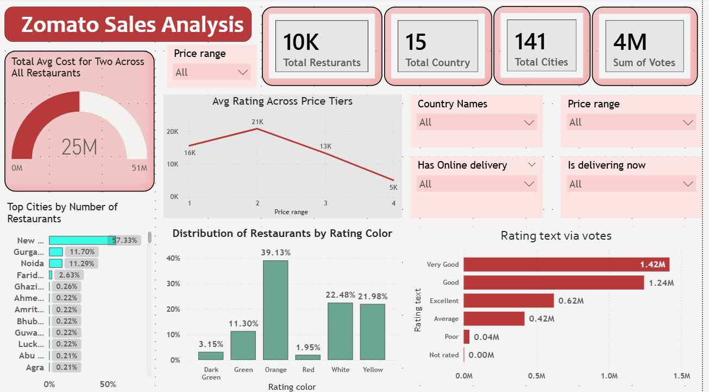

# Zomato Sales Analysis Dashboard (Power BI)

## Project Overview
I developed this **Zomato Sales Analysis Dashboard** using Microsoft Power BI to provide a comprehensive and interactive view of restaurant performance, pricing trends, customer ratings, and delivery insights across India.

The dashboard transforms complex Zomato restaurant data into clear, visually appealing, and actionable insights, helping stakeholders understand market trends, customer preferences, and restaurant distribution patterns.

## Key Insights
- **Total Restaurants**: **10K**
- **Total Cities**: **141**
- **Total Votes**: **4M**
- **Average Cost for Two**: **₹25M** (across all restaurants)

## Business Highlights
- Orange rating color dominates with **39.13%** of restaurants
- **New Delhi** leads with the highest number of restaurants (**37.33%**)
- **Very Good** and **Good** ratings receive the maximum customer votes
- Clear correlation between price range and average restaurant ratings
- Strong presence of online delivery and "delivering now" restaurants

## Dashboard Features

### Overall Metrics
- Key performance cards: Total Restaurants, Cities, Countries, and Votes
- Gauge visualization for Average Cost for Two

### Price & Rating Analysis
- Average Rating trend across different Price Ranges (1 to 4)
- Distribution of restaurants by Rating Color (Dark Green, Green, Orange, Red, White, Yellow)

### Geographic Analysis
- Top Cities by Number of Restaurants with percentage contribution
- City-wise restaurant concentration

### Customer Sentiment Analysis
- Rating text analysis via total votes (Very Good, Good, Excellent, Average, Poor)
- Detailed vote distribution across rating categories

## Tools & Techniques Used
- **Microsoft Power BI Desktop & Power BI Service**
- Advanced **DAX Measures** for calculations
- **Power Query** for data cleaning and transformation
- Professional data modeling and relationships
- Modern visualizations (Gauge, Line Chart, Bar Chart, Donut, KPI cards)

## Interactive Features
- Dynamic filters: Price Range, Country, City, Online Delivery, Delivering Now
- Cross-filtering and drill-down capabilities
- Responsive and clean UI design

## Dashboard Preview

## Project Structure
